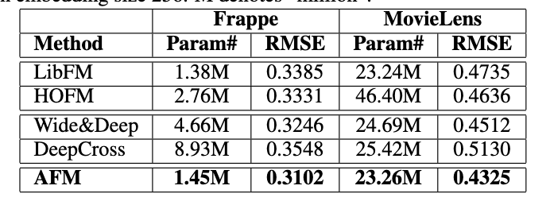

# AFM Model
### 原文PDF：[《Attentional Factorization Machines: Learning the Weight of Feature Interactions via Attention Networks》](Alibaba_AFM.pdf)

## 模型提出背景和研究动机

随着 [FM](https://github.com/HaochengY/RecommendSystem/tree/main/models/FM) 模型的提出开始，多篇论文对其进行了提升，
例如引进了field定义的 [FFM](https://github.com/HaochengY/RecommendSystem/tree/main/models/FFM)，
以及以 [Wide&Deep](https://github.com/HaochengY/RecommendSystem/tree/main/models/WideDeep) 和 [DeepFM](https://github.com/HaochengY/RecommendSystem/tree/main/models/DeepFM) 为代表性的双模型结构。
我们的FM模型似乎无论是从预训练还是Wide或Deep层的改动都已经开发到了极致。

因此，在轰动全球的《Attention is All you need》出版的前夕，`注意力机制`已经开始滋生了萌芽。阿里巴巴基于业务的理解，认为f个特征两两交叉会产生
$f * (f-1)$ 个交叉项，这也是FM和FFM的理念所在。然而他们都认为每个权重都平等的重要，但是这并不合理，有必要聚焦于更主要的权重上，这就是带注意力机制的 
FM模型：`AFM模型`。

## 解决了什么问题？

通过赋予每个交叉系数不同的权重，使得模型可以更好地理解特征间的交互关系，学习到哪些才是更重要的，而
哪些是可以忽略的。
## 如何解决？
模型总的数学表达式可以表示为：

$$ \hat{y}_{AFM}(\mathbf{x}) = w_0 + \sum_{i=1}^{n} w_i x_i + \mathbf{p}^T \sum_{i=1}^{n} \sum_{j=i+1}^{n} a_{ij} (\mathbf{v}_i \odot \mathbf{v}_j) x_i x_j $$
1. 模型先通过embedding层将输入嵌入为稠密的向量
2. 模型进行 `pairwise interaction `, 这里和FM的操作完全一致，就是逐元素乘，这里不再多赘述
3. 注意力层，通过一个看似复杂的公式计算注意力:

    $$ \mathbf{p}^T \sum_{i=1}^{n} \sum_{j=i+1}^{n} a_{ij} (\mathbf{v}_i \odot \mathbf{v}_j) x_i x_j $$
    
    然而这实际上就是将pairwise interaction后的向量输入一个全连接层映射到高维(`attention_dim`), 再映射到一维，接着通过softmax函数将其转化为概率，即各个权重的重要性。
4. 最后再与线性层加和得到结果。
## 效果如何？

可以发现 我们整个AFM是不含MLP的，因此他在参数量上显著少于其他带MLP的模型，同样高，他也比传统的FM模型，以及双模型的Wide&Deep效果要好。
这样看来，注意力的机制却是从机制和底层逻辑上就优于其他模型，理应获得更好的训练效果。