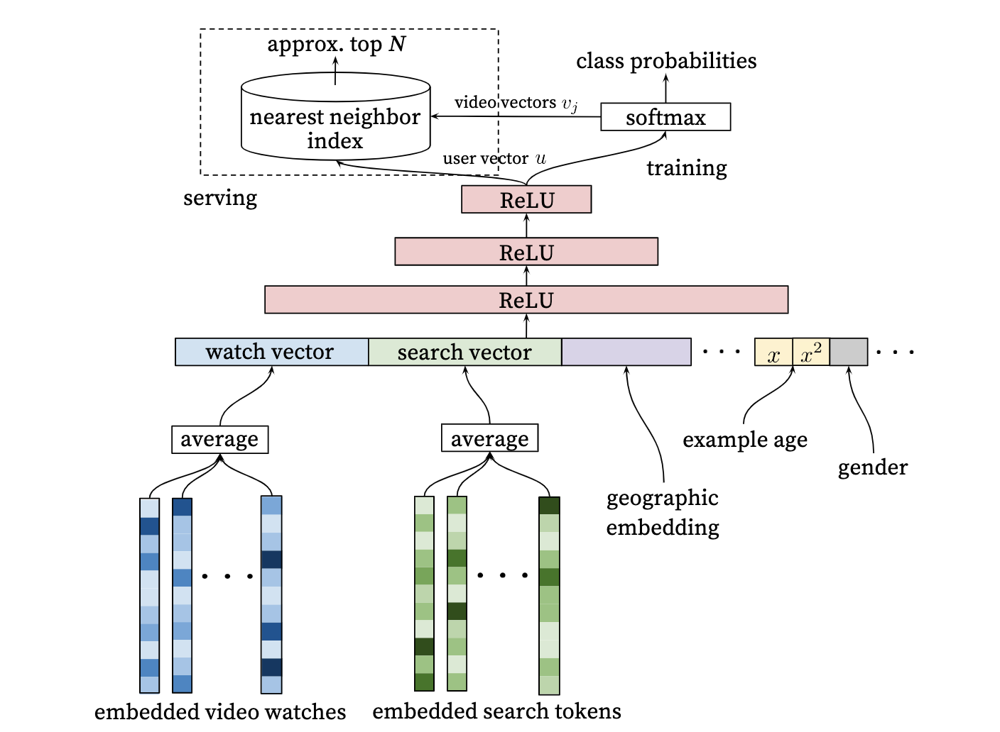
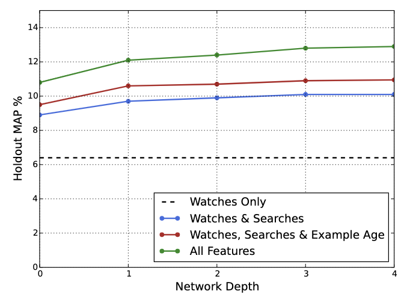
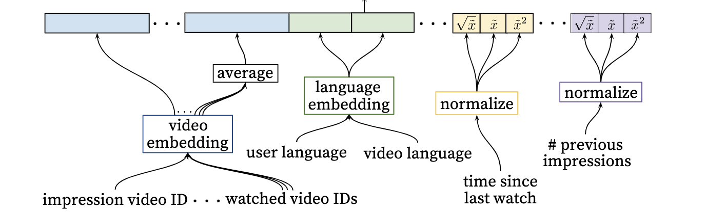

# DNN Model
### 原文PDF：[《Deep Neural Networks for YouTube Recommendations》](DNN.pdf)
## 模型提出背景和研究动机
随着时间来到2016年，多篇深度学习的推荐系统论文横空出世，推荐系统正式步入深度学习时代。在DL引入之前，主流的推荐系统
都在使用FM或FFM模型，他们的效果已经比较不错了。然而我们还是要正式他们的局限性：
1. 无论是FM还是FFM，我们捕捉到的都是 `二阶交叉`。广义上来讲 $n$ 个特征进行k阶交叉的时间复杂度为 $O(n^k)$，
在工程上，如果特征数量过多的时候这一复杂度是不能接受的。这也就导致了我们只能进行二阶交叉。
2. 他们归根结底还是 `线性模型`。尽管隐向量能够捕捉到隐藏信息，但线性模式终归限制了表达。
3. `特征工程依赖性较强`，输入特征仍需进行精心筛选，才能用于训练，这就导致需要对业务有所了解，或对特征进行大量实验筛选。
## 解决了什么问题？
DNN模型作为深度学习最简单的表现形式，它能够自动从数据中进行`特征工程`和`深度交叉`，这一过程是隐式的，具体是如何交叉，如何筛选的，我们不得而知。
但是这一方法终究为我们解决了上述的问题。此外，深度学习模型的结构非常灵活，理论上可以拟合任何函数，也可以满足各类业务的要求。
另一方面来讲，深度学习技术在处理语言，图像等多模态技术上也是无可替代的。
## 如何解决？
将待打分的物品输入dnn，获取预测结果。本文中对`激活函数`，`隐藏层数`，`BN/LN`都进行了封装，可供调试使用。

## 效果如何？

根据图像可以看出，深度学习模型随着输入的特征数量增加，效果（平均Accuracy）是稳步上升的。这就体现了深度学习的优越性，
可以自动进行特征工程，哪怕你输入的特征没有用，甚至有害，通过自动学习就能最大程度减缓特征工程对模型的影响。

## 特征工程
虽然深度学习可以消除特征工程的影响，但是做好数据一定是有必要的。 这篇文章除了模型结果还提供了很多对特征工程的见解。

1. 作者认为用户对视频的兴趣很大程度取决于他看过的其他类似的视频，文章将`他们的embedding向量和他们的平均的embedding向量`一同concat。

2. 对于连续变量，他利用他们的分布的`概率累计函数`将它映射到`0到1之间`：

    $$ \tilde{x} = \int x  \, df(x) $$

    之后在对它进行取`根号`和`平方`，再一起输入，这一步相当于做了数据增强。

## DNN vs DSSM
DSSM就是比较熟悉的`“双塔模型”`，如果从crossing的角度来看，DSSM模型对用户塔和物品塔分别输入DNN，再将输出结果交叉（计算余弦相似度）。

DNN是先将用户和物品交叉(concat)，再输入dnn。

## 超参数调优结果

5%采样：$\alpha=0.001, \gamma=0.3, \text{activation function} = \text{ReLU}$

|         GAUC        | [256]  |[512, 256] |[1024, 512, 256] |[2048, 1024, 512, 256]|
|---------------------|---------------|---------------|---------------|---------------|
| embedding_size = 12 |     0.5502    |    0.5320     |    0.5295     |    0.5313     | 
| embedding_size = 16 |     0.5443    |    0.5248     |    0.5000     |    0.5365     | 
| embedding_size = 20 |     0.5261    |    0.5324     |    0.5382     |    0.5263     | 

5%采样：$\alpha=0.01, \gamma=0, \text{activation function} = \text{ReLU}$

|         GAUC        | [256]     |[512, 256] |[1024, 512, 256]|[2048, 1024, 512, 256]|
|---------------------|-----------|-----------|-------------- -|----------------------|
| embedding_size = 12 |     0.    |  0.5330   |    0.5192      |    0.5344            | 
| embedding_size = 16 |     0.    |  0.5305   |    0.5294      |    0.5352            | 
 

10%采样：$\alpha=0.001, \gamma=0.3, \text{activation function} = \text{ReLU}$

|         GAUC        | [256]  |[512, 256] |[1024, 512, 256] |[2048, 1024, 512, 256]|
|---------------------|---------------|---------------|---------------|---------------|
| embedding_size = 8  |     0.4993    |    0.5000     |    0.5000     |    0.5000     | 
| embedding_size = 12 |     0.4999    |    0.5320     |    0.5295     |    0.5313     | 
| embedding_size = 16 |     0.5443    |    0.5248     |    0.5000     |    0.5365     | 
| embedding_size = 20 |     0.5261    |    0.5324     |    0.5382     |    0.5263     | 
