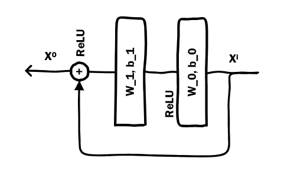
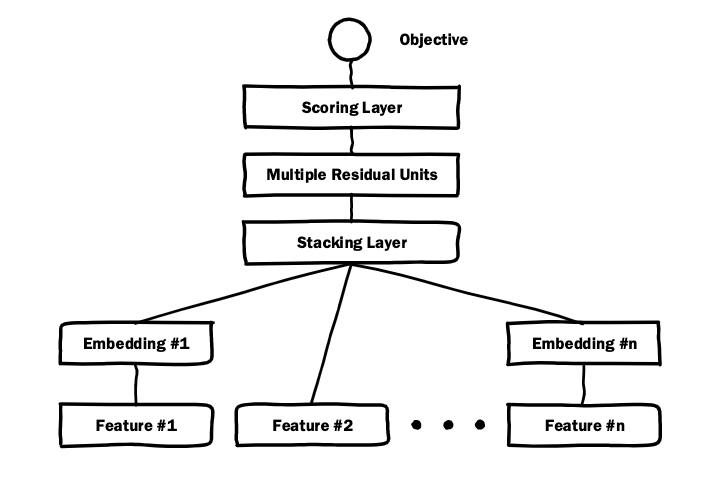

# Deep Crossing Model
### 原文PDF：[《Deep Crossing: Web-Scale Modeling without Manually Crafted Combinatorial Features》](Microsoft_DeepCrossing.pdf)
## 模型提出背景和研究动机
Deep Crossing 是 DNN 的基础上进行的升级版。DNN存在着下面几个问题：
1. `梯度问题`：DNN 中，随着网络层数的加深，梯度消失问题常常导致模型难以训练，特别是当网络变得非常深时，训练效率会大大下降。
2. `特征过度组合`: 特征输入DNN后会进行深度交叉，这种情况有可能是有害的，过于复杂的交叉忽略了特征间浅层的联系（Deep & Cross的思想）

## 如何解决？
Deep Crossing 与 DNN 唯一的区别就是将DNN中的MLP换成 `ResidualMLP (残差连接)`

ResidualMLP 的思想是 `哪怕我的模型不会提升，他也至少不会变差`。 
这一操作优点如下可以很好地解决梯度问题，使得信息传递有一条捷径，这样可以让模型层数更深，增强可训练性。

## 效果如何？
在CP1任务中，Deep Crossing 模型显示出 7-8% 的 离线AUC 提升，这被认为是相当显著的改进，特别是对于点击预测这样的小幅度提升也能显著改善业务表现的任务。