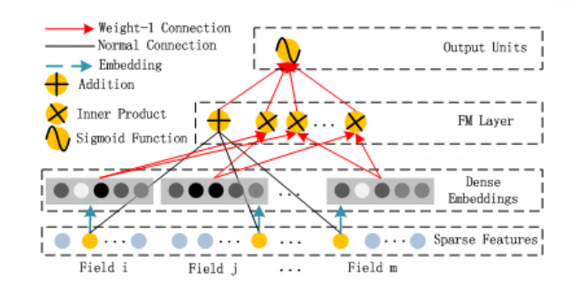

# DeepFM Model
### 原文PDF：[《Wide & Deep Learning for Recommender Systems》](Google_Wide%26Deep.pdf)
## 模型提出背景和研究动机
随着 [Wide&Deep](https://github.com/HaochengY/RecommendSystem/tree/main/models/WideDeep)  模型的提出，越来越多的工作集中到了双模型结构，其中对Wide部分的改进是比较多的，
包括本节的 DeepFM 和 Deep Crossing 模型。

Wide部分的主要问题是显而易见的，因为Wide&Deep本身就是谷歌的运营人员通过业务知识得出来的结果，即如何选择wide部分的特征是需要人工参与的，而深度学习推荐系统
最中心的思想就是最大程度地减少特征工程，力求不需要任何人为操作就能实现特征交叉。

此外，wide模型里就只是进行了一个最简单的线性层，对谷歌商店有效是因为业务理解到位了，在其他情景可能并不奏效。

## 解决了什么问题？
模型试图从两个方向解决：
1. 减少人为的基于业务理解的特征工程
2. 进行比wide更复杂一些的特征交叉

## 如何解决？
将Wide&Deep中的Wide层替换为FM层，该FM层和 [FM](https://github.com/HaochengY/RecommendSystem/tree/main/models/FM) 模型完全一致。

因此这一模型可以视为 FM 和 Wide&Deep 的组合版本。利用FM进行浅层特征交叉（显式上不超过二阶），用MLP进行深度交叉，再结合二者输出。

## 效果如何？

| Model      | AUC (Company) | LogLoss (Company) | AUC (Criteo) | LogLoss (Criteo) |
|------------|---------------|-------------------|--------------|------------------|
| LR         | 0.8640        | 0.02648           | 0.7686       | 0.47762          |
| FM         | 0.8678        | 0.02633           | 0.7892       | 0.46077          |
| FNN        | 0.8683        | 0.02629           | 0.7963       | 0.45738          |
| IPNN       | 0.8664        | 0.02637           | 0.7972       | 0.45323          |
| OPNN       | 0.8658        | 0.02641           | 0.7982       | 0.45256          |
| PNN*       | 0.8672        | 0.02636           | 0.7987       | 0.45214          |
| LR & DNN   | 0.8673        | 0.02634           | 0.7981       | 0.46772          |
| FM & DNN   | 0.8661        | 0.02640           | 0.7850       | 0.45382          |
| **DeepFM** | **0.8715**    | **0.02618**       | **0.8007**   | **0.45083**      |

可以看到在多个数据集上都全部提升，且`不需要进行任何特征工程`，`不需要进行任何预训练`，能`结合深度和浅层特征`
