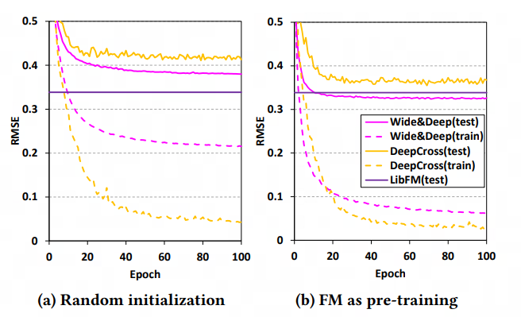
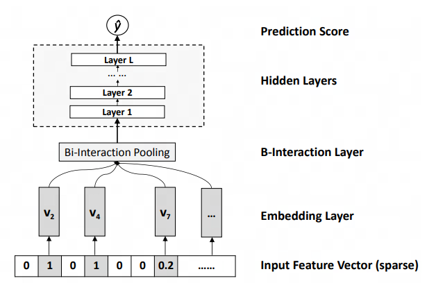
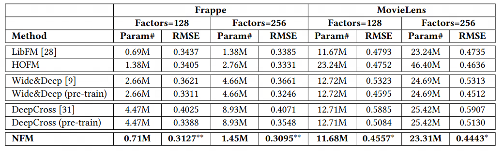

# NFM Model
### 原文PDF：[《Neural Factorization Machines for Sparse Predictive Analytics》](NFM.pdf)
## 模型提出背景和研究动机
受到 `FNN` 模型的启发，作者认为使用FM对DNN的embedding层进行参数初始化的效果显著

此外， [FM](https://github.com/HaochengY/RecommendSystem/tree/main/models/FM) 模型最大的问题就是无法处理二阶以上的特征交叉：

$$\text{FM Output} = \sum_{i=1}^{n} v_i X_i  +  \sum_{i=1}^{n} \sum_{j=i+1}^{n} (v_i v_j) X_j X_i$$

随着深度学习的发展，如果我们将后面的二阶交叉抽象为一个函数 $f(x)$, 理论上来讲，它可以被一个MLP学习到。这样，我们上式就变为：

$$\text{FM Output} = \sum_{i=1}^{n} v_i X_i  + f(x) $$

## 解决了什么问题？
1. 这一模型试图将FM和深度学习结合，提高FM对高阶交叉的捕捉能力
2. DNN模型直接将embedding后的向量输入DNN，不做任何处理，没有显式的特征工程

## 如何解决？

为此，NFM先对数据进行embedding，再将embedding用一种叫做 `Bi-interaction Pooling` 的方法对特征进行交叉。
这里的计算方法和FM极为相似，我们可以对比一下：

1. FM: $$\text{FM Second Order Output} = \frac{1}{2} \sum^{k} (XV)^{\circ 2} -  (X)^{\circ 2} (V)^{\circ 2} $$

2. NFM: $$\text{NFM Bi-interaction Pooling} = \frac{1}{2}  (XV)^{\circ 2} -  (X)^{\circ 2} (V)^{\circ 2} $$

可以发现只是少了一层求和，换句话说，FM直接输出了结果，所以进行了加和，使得输出维度为 `(bs, 1)`, 而`Bi-interaction Pooling`是为了交叉，需要保留维度，十七
输入到MLP, 所以不需要加和，维度为`(bs, k)`。

## 效果如何？

我们可以发现：由于NFM是一个单个模型，不想Wide&Deep类的双模型，他的参数量很小，而且再参数量不高的情况下效果甚至高于Wide&Deep模型。

总的来说，从效果和收敛速度上，NFM的效果都不错。