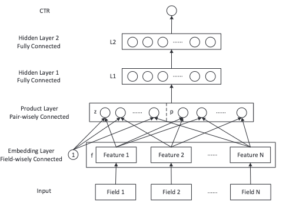

# PNN Model
### 原文PDF：[《Product-based Neural Networks for User Response Prediction》](%E4%B8%8A%E4%BA%A4%E5%A4%A7_PNN.pdf)
## 模型提出背景和研究动机，解决了什么问题？
与DeepCrossing类似，PNN也是一种对简单的基础DNN模型的改进。

DNN模型中，embedding后的向量没有经过任何处理，就被直接输入到了模型中。
这一操作相当于将特征交叉完全交给了MLP去做，即一种隐式的方法。

## 如何解决？

PNN模型再输入MLP之前的concat层进行了改进。模型的输入被分成了两部分：
1. 线性层： 即不做任何处理直接输入
2. 内积层/外积层：对embedding 向量进行数学上的内积外积处理，`显式`地进行特征交叉。
将待打分的物品输入dnn，获取预测结果。

### 内积和外积的区别，以及Pytorch中的实现
1. 内积是 $x \cdot x^{T}$，从维度上来看，是 `(bs, emb_dim) * (bs, emb_dim)` 计算后会降一维度, 变成 `(bs, 1)`
2. 外积是 `$(bs, emb_dim, 1) \times (bs, 1, emb_dim)$`, 计算后会升一维度， 变成 `(bs, emb_dim, emb_dim)`

Pytorch中实现的时候需要保证输入经过PNN层后和不经过的维度一致，都应该是 `(bs, xxx)`, 因此：
1. Pytorch计算内积的实现方法是对tensor先进行`逐元素乘`，再`torch.sum(dim=1)`。 为了避免内积降维，我们需要在
`torch.sum()`中设置参数 `keep_dim=True`, 这样会使得维度不减。
2. Pytorch计算外积的实现方法是对输入的两个变量在不同的维度(1 和 2)上进行`unsequeeze`(.unsequeeze(1), .unsequeeze(2)),
这样维度就会分别变为 `(bs, emb_dim, 1)` 和 `(bs, 1, emb_dim)`。此时由于维度不匹配，无法进行逐元素乘，我们需要做的是矩阵乘法。即 `mm` 操作,
允许对 (m, n) 和 (n, p) 两个矩阵进行乘法。Pytorch 中还对带批次参数的输入做了封装优化，我们可以直接使用 `bmm()` 方法对二者进行相乘。
之后为了避免外积升维，我们会进行`.view(bs, -1)`, 将`(bs, emb_dim, emb_dim)`变为 `(bs, emb_dim * emb_dim)`

内积的计算量比较小，交互后的维度为：`$\frac{1}{2}$(feature_num * (feature_num - 1))`,但交互程度不如外积，因为外积会在所有维度上进行
，但是计算开销大，交互后的维度为：`$\frac{1}{2}$(feature_num * (feature_num - 1) * emb_dim * emb_dim)`。通常来说，外积的计算维度会比内积
大近百倍。因此如何对计算开销和精确度进行权衡需要进行试验。

此外，本文中对`激活函数`，`隐藏层数`，`BN/LN`都进行了封装，可供调试使用。

## 效果如何？

| Model | AUC    | RMSE      |
|-------|--------|-----------|
| LR    | 71.48% | 9.362e-4  |
| FM    | 72.20% | 9.284e-4  |
| FNN   | 75.66% | 9.030e-4  |
| IPNN  | `77.79%` | `8.803e-4 ` |
| OPNN  | 77.54% | 8.846e-4  |

可以看到IPNN的效果是最好的，比FNN这一深度模型还要好。原文还对激活函数的选择进行了调试，感兴趣的读者可以自行研究。

