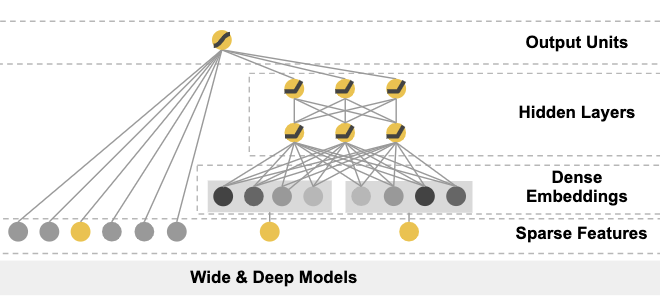

# Wide&Deep Model
### 原文PDF：[《Wide & Deep Learning for Recommender Systems》](Google_Wide%26Deep.pdf)
## 模型提出背景和研究动机
在推荐系统中，有两个关键问题需要解决：`记忆`（memorization）和`泛化`（generalization

1. 记忆：通过学习特征间的频繁共现，模型能够有效记住历史数据中的关联。
2. 泛化：通过探索新的特征组合进行特征交互。如LR或深度学习网络DNN。然而，DNN这种深度神经网络在寻求深度交叉的时候
可能会产生过度泛化，导致推荐不相关的项目。

## 解决了什么问题？
Wide & Deep 模型旨在同时结合记忆和泛化的优势，解决传统模型各自的局限性

1. Wide部分：通过广义线性模型及特征交叉（cross-product transformation）来记忆频繁出现的特征交互。
2. Deep部分：通过嵌入向量和神经网络，能够泛化到以前未见过的特征组合。 这种组合模型能够在稀疏数据下避免深度模型过度泛化，同时利用线性模型进行显式的特征组合记忆。

## 如何解决？
Wide部分将encoder后的输入直接接入一层线性回归层，不进行任何操作。在deep层，先进行embedding，再进入MLP，
最后将wide和deep的输出结果加在一起作为输出。

## 效果如何？

| Model         | Offline AUC | Online Acquisition Gain |
|---------------|-------------|-------------------------|
| Wide (control) | 0.726       | 0%                      |
| Deep          | 0.722       | +2.9%                   |
| Wide & Deep   | `0.728`       | +3.9%                   |

在 `Google Play 应用商店`的推荐系统中，Wide & Deep 模型相比单独的 Wide 模型和 Deep 模型都取得了显著的提升。
具体来看：可以发现无论是离线AUC还是线上的AUC都有明显提升。
