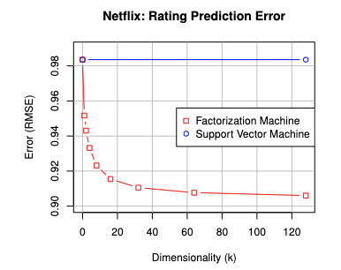

# FM Model
### 原文PDF：[《Factorization Machines》](..%2F..%2FDocument%2FFM.pdf)
## 模型提出背景和研究动机
在FM提出之前，业界比较常用的是两类思路的模型：
### 1. LR Model ：
缺点：无法捕捉特征间的交叉关系
### 2. Matrix Factorization (MF) 模型 ：

- MF模型的`提出背景`： 最早是用来解决协同过滤中user-item矩阵分解的问题的。协同过滤最大的问题在于：
    1. `稀疏问题`：共现矩阵包含大量的缺失值，因为每个用户只对少量物品进行过评分。传统的协同过滤方法表现不佳
    2. `无法捕捉隐含关系`：用户的偏好和物品的特征通常是多维的，基于简单相似度的方法无法揭示这些复杂的特征。
- MF模型给出的`解决方案`: 通过使用`SVD`将 $m\times n$ 的user-item矩阵分解为 $m \times k$ 的用户矩阵和 $n\times k$ 的物品矩阵，这一思路已经无限接近于 `Embedding` 的思想了, 通过映射到低维，可以减少稀疏性，并捕捉隐藏信息。
- MF模型的`缺点`: 
  1. 该方法需要使用SVD，计算复杂度为 $O(m * n^2)$
  2. SVD需要分解的矩阵是稠密的，分解稀疏矩阵效果不佳

因此， 工业界常用数值方法求解：
1. SGD，可以用于小规模数据集，还可以在线学习
2. ALS（交替最小二乘），这一方法适用于Spark分布式计算平台，但不可以在线学习

## 解决了什么问题？
即便如此，SVM的效果依然不佳，为此，FM在二者的基础上，既考虑了二阶交叉，也用 `特征向量的内积` 来作为特征交叉的权重，这样可以避免进行SVD分解，时间复杂度降为 $O((m+n)*k$
## 如何解决？
用 `特征向量的内积` 来作为特征交叉的权重: 

$$\text{FM Output} = \sum_{i=1}^{n} \sum_{j=i+1}^{n} (v_i v_j) X_j X_i$$

假设我们输入的tensorX 的维度是(bs * n) 的，既bs个样本，每个样本特征维度为n。若隐向量的维度为k，既每个特征都被抽象表达为一个k维的向量。那么此时V(V=v_{ij})的维度就变成了 $n * k$
Sum里的两个下标表示, FM的输出是一个上三角阵的输出，即我们每两个特征 $X_i$ 和 $X_j$ 只交叉一次，且不考虑自身的二阶（${X_i} ^ 2$）
那么 

$$\text{FM Output} = \sum_{i=1}^{n} \sum_{j=i+1}^{n} (v_i v_j) X_j X_i$$

$$ = \frac{1}{2} (\sum_{i=1}^{n} \sum_{j=i}^{n} (v_i v_j) X_j X_i - \sum_{i=1}^{n} {X_i}^2) $$

减去自身二阶象，再除二，因为 $X_i$ 和 $X_j$ 交叉与 $X_j$ 和 $X_i$ 交叉是一样的。

上式经过推导可以得到（向量形式）：

$$\text{FM Output} = \sum^{k} (XV)^{\circ 2} -  (X)^{\circ 2} (V)^{\circ 2} $$

## 效果如何？
FM和SVM效果对比图如下：
可以看到效果显而易见。FM 成功地估计了高阶变量交互，在极其稀疏的数据中超越了传统的 SVM。FM 能够处理类似 Netflix 这样拥有数百万条训练数据的大规模数据集，同时其计算和参数优化的复杂度保持在可接受的范围内
